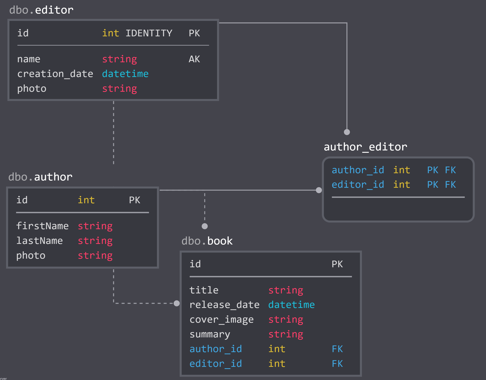

Graphql's example

The node and php (Symfony 4) application share the same logic and behaviour. It's a "library" application where you can create editors, authors and of course books.
Since the goal of the examples is to show the same thing in two differents languages, the database schema is the same and the following.

Please check README.md file in each subfolder to understand how to run a project. Check the README.graphql.md file in each subfolder for query / mutation examples. 
